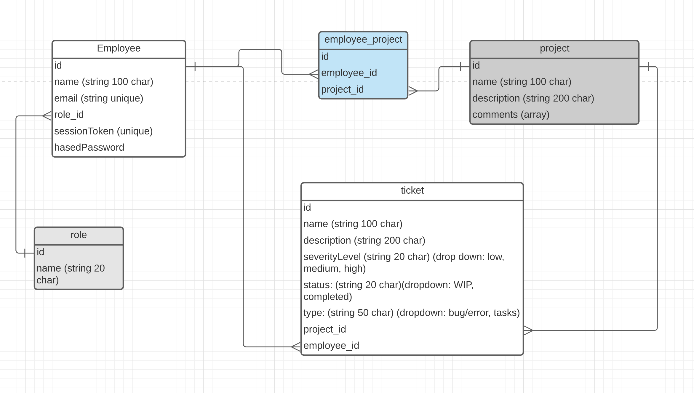
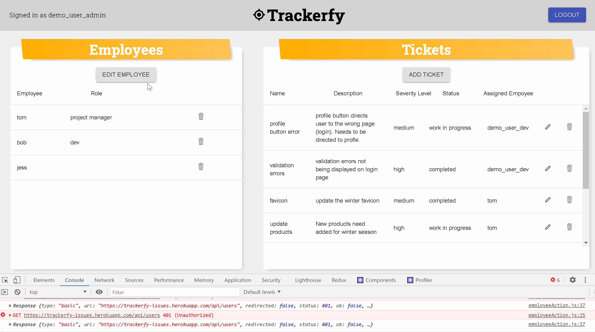
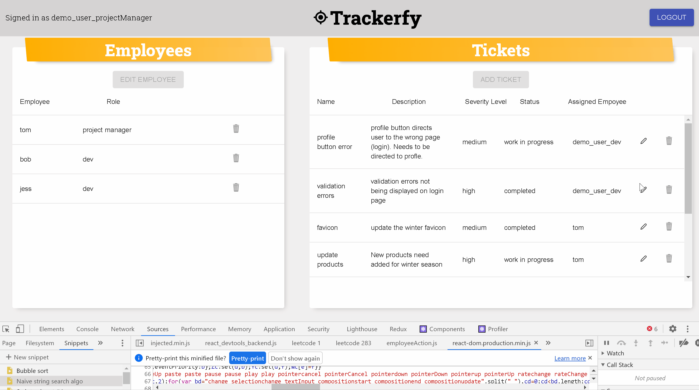
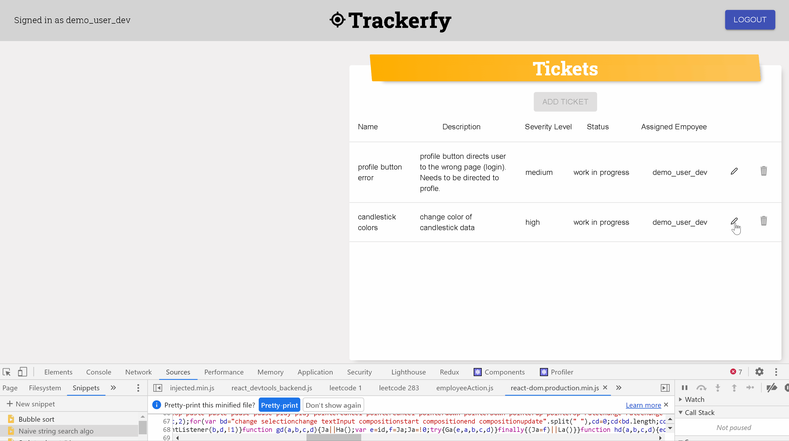
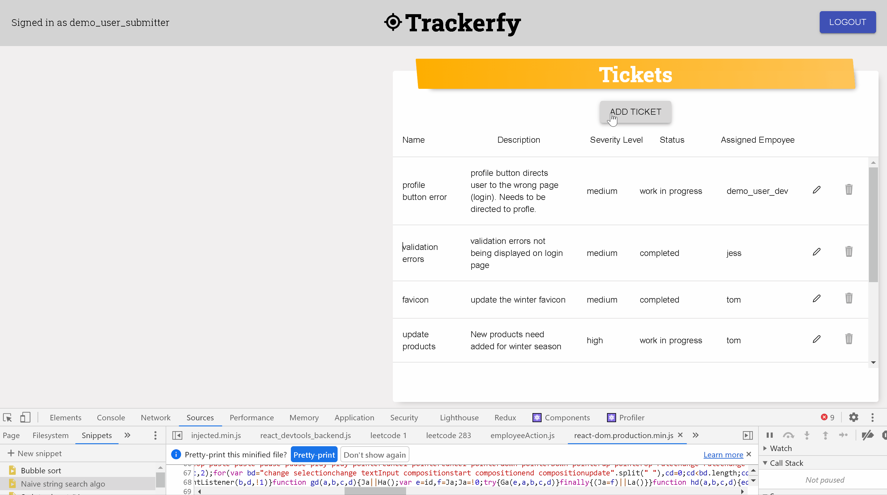

[live Link](https://trackerfy-issues.herokuapp.com/)

## Features 
- [Features Overview](#Features-Overview)
- [Model Schema](#Model-Schema )
- [Roles](#Roles)
    - [Admin](#Admin)
    - [Project Manager](#Project-Manager)
    - [Developer](#Developer)
    - [Submitter](#Submitter)
- [Role Based Access Control](#Role-Based-Access-Control)
- [Todo](#Todo)

## Technologies
- Express
- Sequelize 
- PostgreSQL
- React/Redux
- Heroku

## Notable Packages 
- Front End
    - Materialui
        - for tables, all modals made manually! 
    - React Icons
- Back End
    - rbac (Role Based Action Control)
    - express validator
    - cors
    - bcrypt

## Installation 
1. Clone the respository 
    ```bash
    $ git clone https://github.com/qsmity/Bug-tracker.git
    ```
2. Install dependencies 
- Back End
    ```bash
    $ npm install
    ```
- Front End
    ```bash
    $ cd /client
    $ npm install
    ```
3. Open psql and create user and database
- Create user "trackerfy_app" with password "<<super_strong_secret_password>>"
- Create database trackerfy with owner trackerfy_app

4. Create a .env and add configuration modeled below: 

    ```
    PORT=8080
    DB_USERNAME=trackerfy_app
    DB_PASSWORD=<<super-secret-secure-password>>
    DB_DATABASE=trackerfy
    DB_HOST=localhost
    JWT_SECRET=<<super-secret-hex-code>>
    JWT_EXPIRES_IN=604800 (**which is about a week**)
    ```

5. Migrate to database

   ``` 
    $ npx dotenv sequelize db:migrate
   ```
6. Seed database
    ``` 
    $ npx dotenv sequelize db:seed:all
   ```
## Features Overview 

Trackerfy's main purpose is to 'track' bugs/errors and tasks to be delegated to the appropriate employee in product/app development. There are four main roles: `Admin`, `Project Manager`, `Developer (dev)`, and `Submitter`: `Admin` has all access permissions (including assigning roles to new employees), `Project Managers` assign tickets, `Submitters` create tickets, and `Developers` manage ticket status. The major features highlighted below are mainly based on the four different roles described, but the web app also includes functionality of CRUD for tickets, employees, and projects. 

> Current Status: on-going development 

### Model Schema 
***


## Roles

### Admin
***
Admin has all access permissions of all roles with an additional power to edit employee roles once an employee was added to the system (usually a new hire)



### Project Manager
***
Project Managers have the ability to assign employees to tickets and change the severity level of the ticket. All other fields are read only. Project managers can see all projects and tickets in the database. 



### Developer
***
Developers only have the ability to update the status of the ticket to `completed` or `work in progress`. Devs can only view projects and tickets assigned to them. 




### Submitter
***

Submitters only have the ability to add a new ticket with an associated project. They don't even have the ability to assign anyone to the ticket so it's not apart of the form.  Submitters can see all tickets and projects in the database so they can see what has aleady been created and assigned. 




### Role Based Access Control
Role based access control was a fun puzzle to solve. I thought about potentialy creating middlewares to verify the role of the user, but found that incorporating the rbac npm package was the perfect fit for this project. All resource management based on role access is done in the Back End, but the Front End does have a bit of conditional logic to disable buttons and hide things from view based on the role. Even if a bad actor were to make those features visible, they still would not have access to sensitive information handled in the Back End. 

The role of the user is added to the JWT token that is created when the user logs in or signs up. Once the user is found in the database, the `role` from the `Employee` table (as the `user` in this `getUserToken` function paramter) is added to the `userDataForToken` object. This ensures that the role is sent with every request, which is integral to verify permissions.  

```js
// auth.js file

    const getUserToken = (user) => {
  // Don't store the user's hashed password
  // in the token data.
  const userDataForToken = {
    id: user.id,
    email: user.email,
    role: user.roleId
  };

  // Create the token.
  const token = jwt.sign(
    { data: userDataForToken },
    secret,
    { expiresIn: parseInt(expiresIn, 10) } // 604,800 seconds = 1 week
  );

  return token;
};
```
An access control `grantsObject` is created to establish user role Authorization for CRUD features and is exported for other routes to access: 

```js
//mapping roles based off roleId in db
    //1 = admin
    //2 = projectManager
    //3 = dev
    //4 = submitter

let grantsObject = {
    1: {
        tickets: {
            'create:any': ['*'],
            'read:any': ['*'],
            'update:any': ['*'],
            'delete:any': ['*']
        },
        projects: {
            'create:any': ['*'],
            'read:any': ['*'],
            'update:any': ['*'],
            'delete:any': ['*']
        },
        employees: {
            'update:any': ['roleId'],
            'read:any': ['*']
        }
    },
    2: {
        tickets: {
            'read:any': ['*'],
            'update:any': ['severityLevel', 'status'],
        },
        projects: {
            'read:any': ['*'],
            'delete:any': ['*'],
            'update:own': ['employeeId'],
        },
        employees: {
            'read:any': ['*']
        }
    },
    3: {
        tickets: {
            'read:own': ['*'],
            'update:own': ['comments', 'status']
        },
        projects: {
            'read:own': ['*'],
        }
    },
    4: {
        tickets: {
            'read:any': ['*'],
            'create:any': ['*']
        },
        projects: {
            'read:any': ['*'],
        }
    }
};

//export grant objects for permissions to be accessed in other routes
module.exports = {
    projectsRouter: router,
    grantsObject,
    ac
}
```

Each Back End route that has access to the database to return a resource / collection of resources is protected by checking their access level. Based on the role, some routes return a limited amount of items back from the database. For example, Admin can recieve all projects from the db, but a dev can only receive their own projects they are assigned to. 

```js 
//projects.js file

//get all projects in db based on role
router.get('/', requireAuth, asyncHandler(async (req, res, next) => {
    //req.user.role is set in the requireAuth middleware
    const role = req.user.role
    if (role) {
        //admin role or submitter role which returns a boolean if permission granted
        const permissionAdminSubmitter = ac.can(`${role}`).readAny('projects')

        //get all projects if admin role
        let projects;
        if (permissionAdminSubmitter.granted) {
            projects = await Project.findAll({
                include: [Employee]
            })

            //only get projects assigned to (dev, projectManager)
        } else {
            projects = await Project.findAll({
                include: {
                    model: Employee,
                    where: {
                        id: req.user.id
                    }
                },
            })
        }
        if (projects) {
            res.status(200)
            res.json({ projects })
        } else {
            res.status(404).send('resource not found')
        }
    } else {
        //build functionality for if role is not defined (new user)
        const err = new Error('permission denied')
        err.title = 'permission denied'
        err.status = 401
        err.errors = ['role not assigned']
        next(err)
    }

}))
```
Note: The line of code that checks permission using the access control pkg is: 
``` js
const permissionAdminSubmitter = ac.can(`${role}`).readAny('projects')
```
The role that is extracted from the token is interpolated in `ac.can()`. A conditional is used to determine what to send back. If the role had `readAny` permissions in this case,

```js
    if (permissionAdminSubmitter.granted) {
        ...
    }
```
...then either all the projects are returned (admin), or just the projects associated with the logged in employee. 

### Todo 
***
- [ ] Filtering for tables
- [ ] Pagination for tables to replace scrolling
- [ ] Ability to add comments on tickets
- [ ] Add multiple employees in select field of projects. Back End functionality already set up to accept multiple employees
- [ ] Dark mode theme
